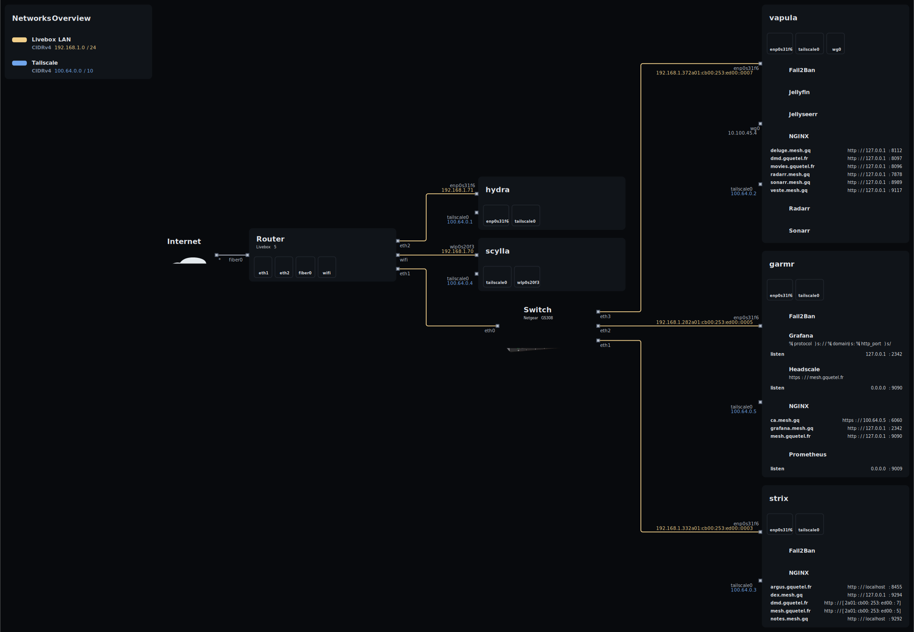
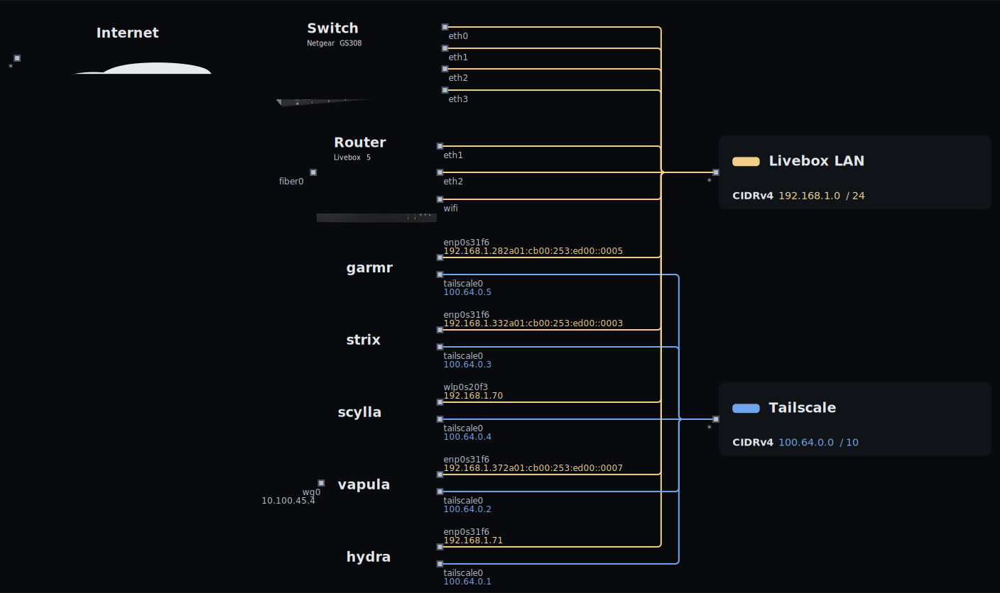

## NixOS Config

A repository containing the configurations of my machines running NixOS. Existing machines are: 
- [hydra](./machines/hydra/): an old gaming desktop, today used for remote work. No fancy software are installed, it mostly consists of those used for research (Zotero,Oobsidian, typst, ...)  
- [scylla](./machines/scylla/): a laptop for work, no fancy config here either, same installed software programs as hydra.
- [strix](./machines/strix/): a ThinkCenter acting as a webserver, also host a gitlab-runner and an outline instance.
- [garmr](./machines/garmr/): a ThinkCenter hosting a Headscale server a step-ca powered Certificate Authority, a Grafana and Prometheus instance.  
- [vapula](./machines/vapula/): a ThinkCenter acting as mediaserver with zfs disks.

### Topology 
These diagrams show the topology of my home network (the main overview, and a network overview).

Here are some nix-specific packages that might interest you, that are used in this repository: 
- [agenix](https://github.com/ryantm/agenix): To encrypt and manage secrets according to specific SSH keys.
- [colmena](https://github.com/zhaofengli/colmena): A neat configuration deployment tool. This is a wrapper around your usual configuration deployment. It supports parallel deployment and is great to quickly update the Thinkcenters.
- [nix-topology](https://github.com/oddlama/nix-topology): To generate topology diagrams from a NixOS configuration.
