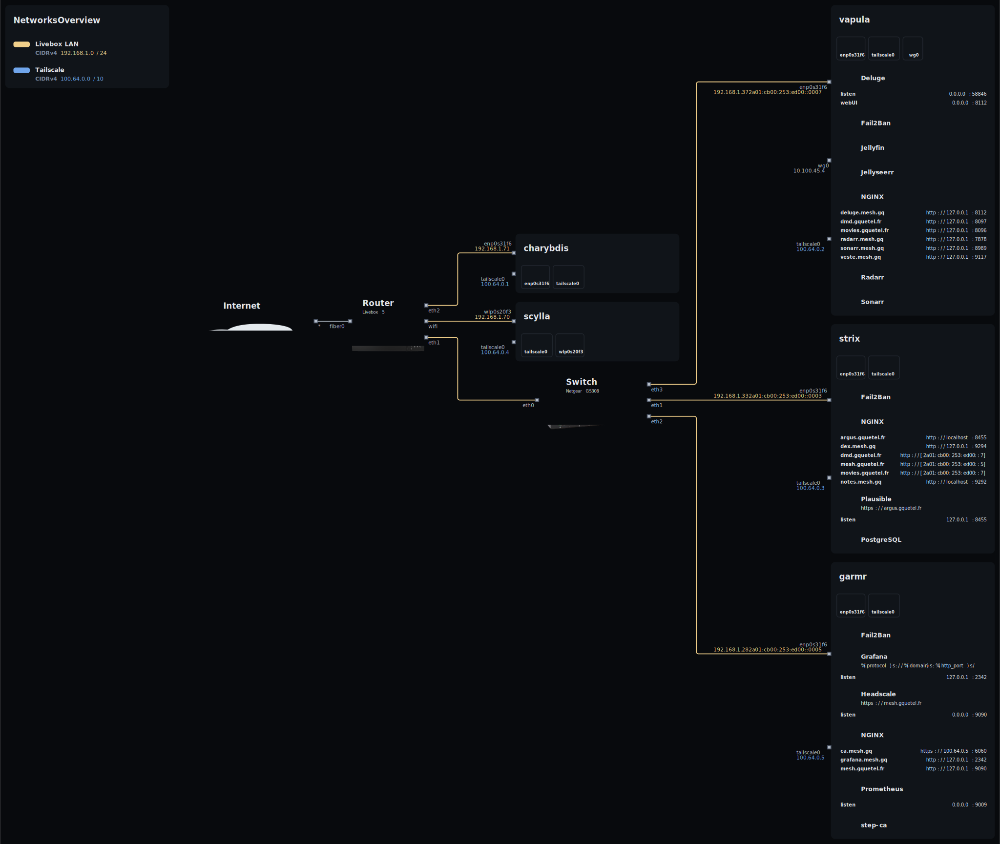

# NixOS Configuration

This repository contains the NixOS configurations for my machines. Each host is defined declaratively and managed from this repository.

### Machines 

- [charybdis](./machines/charybdis/): A gaming desktop with an AMD Ryzen CPU and RTX 3060 Ti, also used for remote work. The setup includes Steam, Docker, and research-related tools.
- [scylla](./machines/scylla/): A work laptop with minimal configuration and research-related tools.
- [strix](./machines/strix/): A ThinkCentre used as a web server and SNI proxy. It also hosts an Outline instance, Plausible analytics, and a GitLab Runner.
- [garmr](./machines/garmr/): A ThinkCentre running infrastructure services, including Headscale, step-ca (certificate authority), and monitoring with Grafana and Prometheus.
- [vapula](./machines/vapula/): A ThinkCentre acting as a media server, backed by ZFS storage.

### Topology 
These diagrams show the topology of my home network, including a main overview, and a network-specific layout.

## Nix Resources Used

Here are some nix-specific packages that might interest you, that are used in this repository: 
- [agenix](https://github.com/ryantm/agenix): Used to encrypt and manage secrets based on SSH keys.
- [colmena](https://github.com/zhaofengli/colmena): A deployment tool for NixOS configurations. It supports parallel deployments and is well suited for managing multiple machines such as the ThinkCentres.
- [nix-topology](https://github.com/oddlama/nix-topology): Generates network topology diagrams directly from NixOS configurations.
- [npins](https://github.com/andir/npins) A dependency-pinning tool for Nix projects.